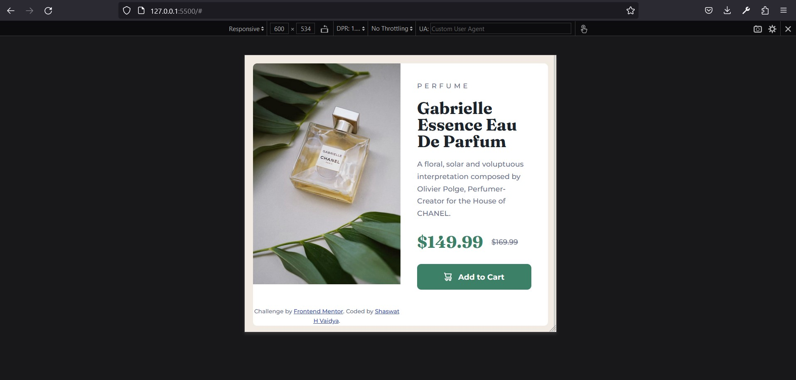
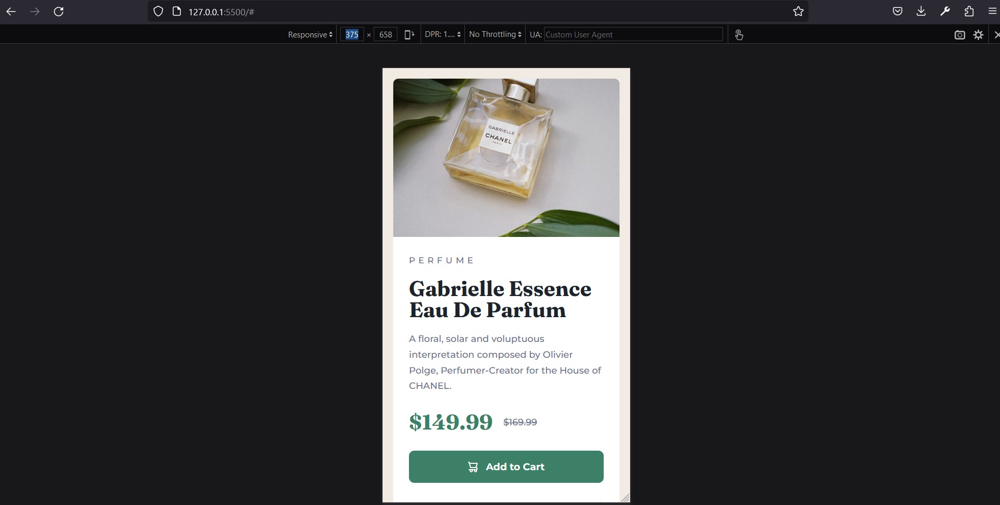

# Frontend Mentor - Product preview card component solution

This is a solution to the [Product preview card component challenge on Frontend Mentor](https://www.frontendmentor.io/challenges/product-preview-card-component-GO7UmttRfa). Frontend Mentor challenges help you improve your coding skills by building realistic projects.

## Table of contents

- [Overview](#overview)
  - [The challenge](#the-challenge)
  - [Screenshot](#screenshot)
- [My process](#my-process)
  - [Built with](#built-with)
  - [What I learned](#what-i-learned)
  - [Useful resources](#useful-resources)
- [Author](#author)

## Overview

This is a challenge from [FrontendMentor.io](https://www.frontendmentor.io/challenges/product-preview-card-component-GO7UmttRfa/hub).

### The challenge

Users should be able to:

- View the optimal layout depending on their device's screen size
- See hover and focus states for interactive elements

### Screenshot




## My process

I first completed the mobile view and then switched to the desktop view. This process has helped me a lot because it is much easier to align div according to the desktop view. I use desktop view for some design references but I completed my mobile view.

### Built with

- Semantic HTML5 markup
- CSS custom properties
- Flexbox
- CSS Grid
- Mobile-first workflow

### What I learned

I have learned why it is necessary to hide some of the content in the user interface and how to use multiple images so that they can render according the size of your screen.

To see how you can add code snippets, see below:

```html
<picture class="product__img">
  <source
    srcset="images/image-product-desktop.jpg"
    media="(min-width: 600px)"
  />
  
</picture>
```

```html
<div class="flex-group">
  <p class="product__price">
    <span class="visually-hidden">Current Price:</span>$149.99
  </p>
  <p class="product__original-price">
    <span class="visually-hidden">Original Price:</span><s>$169.99</s>
  </p>
</div>
```

```css
.visually-hidden:not(:focus):not(:active) {
  clip: rect(0 0 0 0);
  clip-path: inset(50%);
  height: 1px;
  overflow: hidden;
  position: absolute;
  white-space: nowrap;
  width: 1px;
}
```

### Useful resources

- [CSS Reset](https://www.joshwcomeau.com/css/custom-css-reset/) - This helped me with the default CSS reset which is required to sand down some of the rough edges in the CSS language.
- [Inclusively Hidden](https://www.scottohara.me/blog/2017/04/14/inclusively-hidden.html) - This is an amazing article which helped me finally understand why we need to hide some content in web interface. I'd recommend it to anyone still learning this concept.

## Author

- Frontend Mentor - [@Shaswat0707](https://www.frontendmentor.io/profile/Shaswat0707)
- LinkedIn - [Shaswat Vaidya](https://www.linkedin.com/in/shaswat-vaidya-618a427b/)
