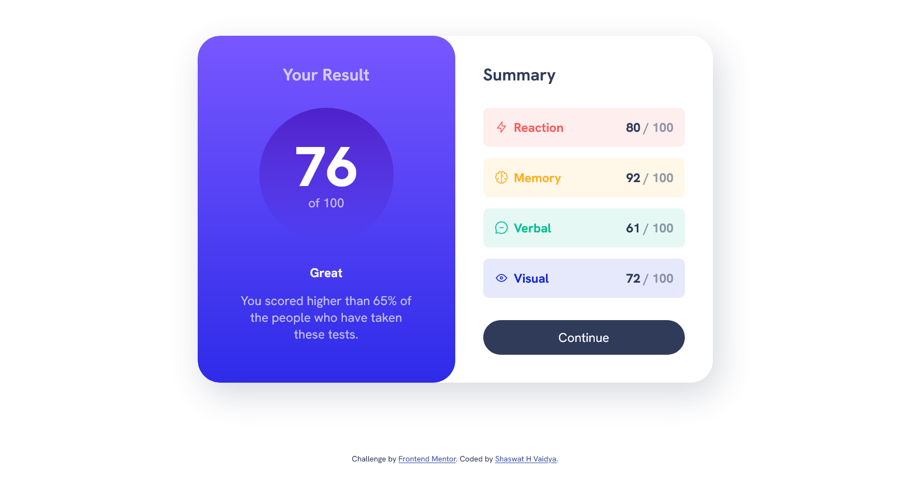

# Frontend Mentor - Results summary component solution

This is a solution to the [Results summary component challenge on Frontend Mentor](https://www.frontendmentor.io/challenges/results-summary-component-CE_K6s0maV). Frontend Mentor challenges help you improve your coding skills by building realistic projects.

## Table of contents

- [Overview](#overview)
  - [The challenge](#the-challenge)
  - [Screenshot](#screenshot)
- [My process](#my-process)
  - [Built with](#built-with)
  - [What I learned](#what-i-learned)
  - [Useful resources](#useful-resources)
- [Author](#author)

## Overview

The task is to create a result summary component.

### The challenge

Users should be able to:

- View the optimal layout for the interface depending on their device's screen size
- See hover and focus states for all interactive elements on the page
- **Bonus**: Use the local JSON data to dynamically populate the content

### Screenshot




## My process

I first completed the mobile view and then switched to the desktop view. This process has helped me a lot because it is much easier to align div according to the desktop view. I use desktop view for some design references but I completed my mobile view.

### Built with

- Semantic HTML5 markup
- CSS custom properties
- Flexbox
- CSS Grid
- Mobile-first workflow

### What I learned

I have learned how it is necessary to use data attributes in a div and we can manipulate the css using them.

```html
<div class="results grid-flow" data-spacing="large">
  <h1 class="section-title">Your Result</h1>
  <p class="result-score"><span>76</span> of 100</p>
  <div class="grid-flow">
    <p class="result-rank">Great</p>
    <p>You scored higher than 65% of the people who have taken these tests.</p>
  </div>
</div>
```

```css
.grid-flow[data-spacing="large"] {
  gap: 2rem;
}
```

### Useful resources

- [A Complete Guide to Data Attributes ](https://css-tricks.com/a-complete-guide-to-data-attributes/) - This helped me to understand how handy it is to make up your own HTML attributes and put your own information inside them.

## Author

- Frontend Mentor - [@Shaswat0707](https://www.frontendmentor.io/profile/Shaswat0707)
- LinkedIn - [Shaswat Vaidya](https://www.linkedin.com/in/shaswat-vaidya-618a427b/)
